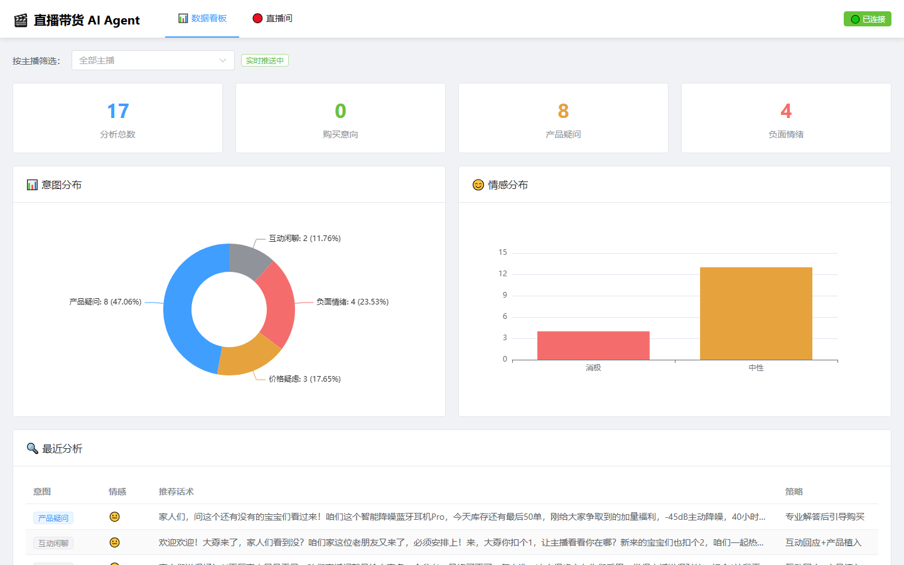
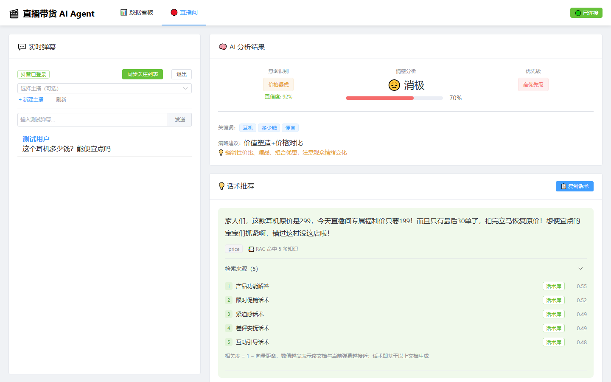

# 直播带货 AI 话术助手

> 实时接入直播弹幕 → LLM 意图识别 → RAG 知识检索 → 生成可直接口播的推荐话术与执行策略 → WebSocket 实时推送前端。

基于 **LangGraph StateGraph 六节点工作流 + RAG** 的直播带货话术辅助系统。帮助主播在海量弹幕中实时捕捉购买意向、价格疑虑、竞品对比等关键信号并精准回应。

---

## 界面预览

<table>
<tr>
<td width="50%" valign="top">

**数据看板** — 意图分布 / 情感分布 / 最近分析记录（WS 实时推送）



</td>
<td width="50%" valign="top">

**直播间** — 实时弹幕流 / AI 分析结果 / 话术推荐 + RAG 检索来源展开



</td>
</tr>
</table>

---

## 业务痛点

直播弹幕量大、节奏快，主播很难实时捕捉关键信息（购买意向、价格疑虑、竞品对比等）并精准回应 —— 观众释放的购买信号一眨眼就刷过去，错过就是白白流失的转化。

系统用 AI Agent 实时分析弹幕语义，结合商品知识库 RAG 检索生成针对性话术推荐，把握每一个转化机会。

---

## 技术栈

| 层级 | 选型 |
|------|------|
| Web 服务 | FastAPI + WebSocket |
| AI 编排 | LangGraph StateGraph（六节点） |
| LLM | 腾讯 TokenHub `deepseek-v4-flash`（OpenAI 兼容） |
| 向量数据库 | ChromaDB |
| 关系数据库 | SQLite + SQLAlchemy（async） |
| Embedding | 可插拔：`api`（OpenAI 兼容）/ `local_bge` / `chroma_default` |
| 前端 | Vue 3 + TypeScript + Element Plus + ECharts + Pinia |
| 通信 | HTTP + WebSocket 双通道 |

---

## 技术选型

### 1. LangGraph 六节点工作流

`预处理 → 意图识别 → RAG 检索 → 话术输出 → 策略推荐 → 结果整合`，使用 `TypedDict` 定义跨节点共享状态（约 19 个字段），任一节点异常降级兜底、不中断整条链路。

**为什么选它**：话术生成不是单次 LLM 调用能解决的 —— 要先判意图、再按意图决定检索范围、再结合商品上下文生成话术、还要附策略。用状态图把这条链路显式建模，每个节点可独立观测与降级，比"一个巨大的 prompt"可维护得多。

### 2. 结构化输出 + JSON 容错

固定 Schema 约束大模型返回**意图类型、置信度、情感倾向与关键词**；JSON 容错解析失败时回退默认值 / 纯文本话术，保证输出稳定可核验。

**踩过的坑**：LLM 输出 JSON 格式漂移会直接抛异常打断链路 → 首尾花括号容错解析 + 失败回退纯文本 + 每节点独立兜底，三层防护。

### 3. 意图路由 doc_type 检索

按识别出的意图做 `doc_type` 过滤路由 —— 产品疑问命中商品知识库、购买意向与价格疑虑命中话术库；过滤后命中不足则自动回落全库，解决"话术答非所问"。

**为什么需要**：早期一条价格弹幕命中了产品参数文档，生成的话术像在念产品手册。检索范围必须跟着意图走。

### 4. 实时推送与节奏控制

HTTP + WebSocket 双通道实时推送，断线 3s 自动重连；通过批处理参数控制节奏、**单次广播替代逐端推送**，保证关键购买信号不漏接。

**看板也走推送**：分析结果落库后，同一帧广播附带 `stats` 统计快照（与 HTTP `/analysis/stats` 共用同一实现，推送值与接口返回值永远同口径），看板无需自己轮询；另留 30s 低频兜底，防推送断开时看板冻结。

### 5. 检索来源可解释

`rag_sources` 完整回传命中文档的 `title / score / type`，前端「检索来源」面板逐条展开 —— 一句话术由哪几篇知识生成、命中哪个知识库、相关度多少，全部可见可验证。

---

## 实现流程

### 实时 · 弹幕处理主链路

| # | 节点 | 说明 |
|:--|:--|:--|
| 1 | 弹幕接入 | HTTP + WebSocket 双通道，断线自动重连 |
| 2 | 预处理 | 批处理参数控制节奏，单次广播替代逐端推送 |
| 3 | 意图识别 | 结构化输出：类型 / 置信度 / 情感 / 关键词 |
| 4 | 置信度门控 | `< 0.6` 弹幕降优先级，不做无效输出 |
| 5 | RAG 检索 | `doc_type` 按意图路由，命中不足回落全库，`top_k=5` |
| 6 | 话术生成推送 | 50~150 字口语化、可直接口播；按意图映射策略优先级 |

### 数据 · 持久化与复盘链路

| # | 节点 | 说明 |
|:--|:--|:--|
| 1 | SQLite 持久化 | 6 张表，SQLAlchemy 异步建模 |
| 2 | 幂等播种 | 演示与测试数据可复现 |
| 3 | 分布统计 | 意图 / 情感基于真实持久化数据（非内存计数） |
| 4 | 数据看板 | ECharts 分布渲染，支撑话术与策略复盘 |

---

## 核心指标

| 指标 | 数值 | 备注 |
|:--|:--|:--|
| LangGraph 节点 | **6 个** | 预处理 → 意图识别 → RAG → 话术生成 → 策略推荐 → 结果整合 |
| 意图类别 | **6 类** | `other` 无对应策略 |
| 策略模板 | **5 类** | 价值塑造 / 价格对比 / 信任背书等 |
| 数据库表 | **6 张** | SQLite |
| 本地验证 | **11 条知识文档入库，4 条测试弹幕分类全对** | 置信度 0.9~0.95 |
| 前端 WS 重连 | **3s** | 弹幕上限 100 条 |
| 看板数据来源 | **WS 推送 + 30s 兜底** | 推送值与 `/api/analysis/stats` 同口径 |
| 检索来源 | **回传 title / score / type** | 相关度 = 1 − 向量距离 |

---

## 快速开始

```bash
# 一键启动（Windows，后端 8000 + 前端 5178）
start.bat

# 或手动
cd project/backend && .venv\Scripts\python.exe main.py   # http://127.0.0.1:8000/docs
cd project/frontend && npm run dev                       # http://localhost:5178
```

`.env` 由 `project/backend/.env.example` 复制而来。关键项：

| 变量 | 说明 |
|:--|:--|
| `LLM_API_KEY` | TokenHub 或任意 OpenAI 兼容服务的 Key |
| `LLM_BASE_URL` | 默认腾讯 TokenHub 网关 |
| `LLM_MODEL` | 默认 `deepseek-v4-flash` |
| `EMBEDDING_PROVIDER` | `api` / `local_bge` / `chroma_default` 三选一 |

> 无 API Key 时链路可启动，但意图识别会退化 —— 建议先配置 Key 再联调。

---

## 目录结构

```
.
├── project/                  # 代码主体
│   ├── start.bat             # 一键启动（后端 8000 + 前端 5178）
│   ├── backend/
│   │   ├── main.py           # FastAPI 入口（启动时建表 + 初始化知识库）
│   │   ├── core/
│   │   │   ├── langgraph_agent.py   # ⭐ 六节点 StateGraph 工作流
│   │   │   ├── danmaku_analyzer.py
│   │   │   ├── script_recommender.py
│   │   │   └── rag_engine.py
│   │   ├── models/           # SQLAlchemy 模型 + Pydantic schema + 幂等播种
│   │   ├── routers/          # danmaku（含 WebSocket）/ analysis / scripts
│   │   ├── rag/              # vector_store + knowledge_base + embedding
│   │   ├── data/knowledge/   # products.json / scripts.json
│   │   └── sql/              # 建表与初始数据 SQL
│   └── frontend/
│       ├── src/views/        # Dashboard.vue / LiveRoom.vue
│       ├── src/components/   # AnalysisPanel / ScriptRecommend / StatsChart
│       ├── src/utils/websocket.ts   # WS 客户端（自动重连 3s）
│       └── src/stores/       # Pinia 状态
├── docs/
│   ├── 项目文档.md           # 权威文档（背景/架构/进度/踩坑/口径）
│   └── 代码评审报告_OCR全量扫描_20260925.md   # 全量 AI 代码审查与修复报告
└── screenshots/              # 界面截图
```

---

## 已知限制与路线图

**已知限制（如实列出）**

- **延迟**：设计目标 `< 2s`，但本机只有推理型模型，单条实测 20~50s（思考 token 数百）。已通过 `BATCH_SIZE=10`、`ANALYSIS_INTERVAL=5`、单次广播、低置信度降级缓解；换非推理模型（如 `deepseek-chat`、`qwen-turbo`）可显著改善。
- **中文向量精度**：`chroma_default` 用的是英文 MiniLM，中文检索精度一般；需装 `sentence-transformers` 使用 `bge-small-zh`。
- **多直播间并发**：WebSocket 广播**已按 `session_id` 分组隔离**（连接管理器按会话维护连接列表，不存在多会话串消息）。真正的限制在采集侧 —— `DouyinClient` 的弹幕采集是**全局单例**（单个 Playwright page、单个采集 task，`/live/capture/stop` 不区分主播），同一时间只能采一个直播间。

**路线图**

- [ ] 话术回归评测集 —— 高频意图抽样构建评测集，Prompt 变更自动跑批对比，迭代有据
- [ ] 看板指标扩展 —— 接入转化相关指标与多直播间参数模板，复盘维度更细
- [ ] 同意图 A/B 话术对比 —— 同一意图多版话术对比投放，以真实弹幕转化数据驱动话术库迭代
- [ ] 高峰削峰队列 —— 弹幕峰值缓冲队列 + 优先级调度，保证大促场次高并发下关键信号不丢失
- [ ] 采集侧多直播间并行 —— 当前采集为全局单例，需按 `anchor_id` 维护独立采集任务与页面

---

## 工程质量与代码审查

本项目用 [阿里云 Open Code Review](https://github.com/alibaba/open-code-review) 对 `project/` 下全部业务源文件做过一轮**全量 AI 审查**，共 106 条意见 —— 但**逐条回源核实后分类处理**：确认为真的修，判定为误报的驳回并留档理由。

| 项 | 结果 |
|:--|:--|
| 审查覆盖 | 47 个业务文件（backend + frontend 全量） |
| AI 原始意见 | **106 条** |
| 去噪后真实问题 | **6 高优先级 + 12 中优先级** |
| 已修复 | **20 个文件** |
| 驳回误报 | 5 条（含 1 条 critical 级幻觉） |
| 回归验证 | 51 项行为断言全过 · `vue-tsc` 退出码 0 · `GET /api/health` → `ok` |

**修复聚焦三处系统性风险**：异步链路里的同步阻塞（`asyncio.to_thread` 下沉检索）、采集回调缺异常隔离（三步各自 try/except，单条坏弹幕不再掀翻整条采集任务）、前端资源释放不完整（连接与监听器回收）。另含向量库内容寻址 ID（幂等重建）、会话计数原子 UPDATE、输入校验与降级标记等。

> **一个值得说的点**：AI 审查的结论**不能照单全收**。106 条意见里约 1/3 是误报或噪音 —— 包括把**正确的** `"price": 299` 幻觉成拼写错误的 critical、给空 `__init__.py` 报 high。反过来，它**也漏了真 bug**：`routers/scripts.py` 用 f-string 直插 `str, Enum` 枚举，得到 `"IntentType.PURCHASE"` 而非 `"purchase"`，导致不带 `context` 的话术请求拿错词去检索。**AI 扫描 + 人工回源核实**，两条腿才走得稳。

完整报告（逐条证据 / 误报清单 / 验证方式 / 工具使用备忘）：[`docs/代码评审报告_OCR全量扫描_20260925.md`](docs/代码评审报告_OCR全量扫描_20260925.md)

---

## 文档

| 文档 | 内容 |
|:--|:--|
| [`docs/代码评审报告_OCR全量扫描_20260925.md`](docs/代码评审报告_OCR全量扫描_20260925.md) | 全量 AI 代码审查报告：106 条意见的去噪 / 修复 / 误报核实与回归验证 |
| [`docs/项目文档.md`](docs/项目文档.md) | 唯一权威文档：背景 / 目录结构 / 技术栈 / 架构 / 进度 / **踩坑记录** / 数据口径 |
| [`project/README.md`](project/README.md) | 代码主体说明与运行细节 |

---

## 许可

本项目为个人作品，代码仅供学习与交流参考。
